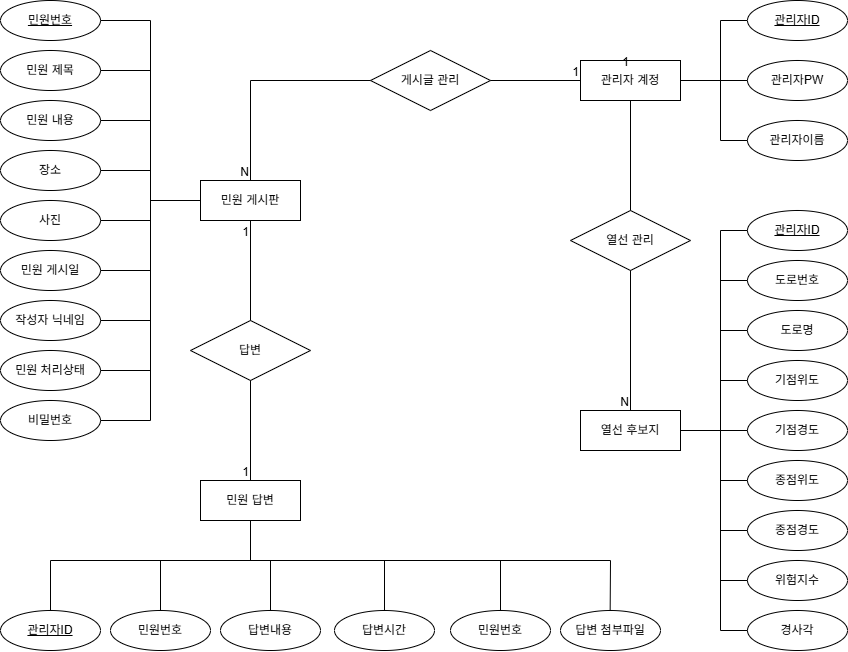
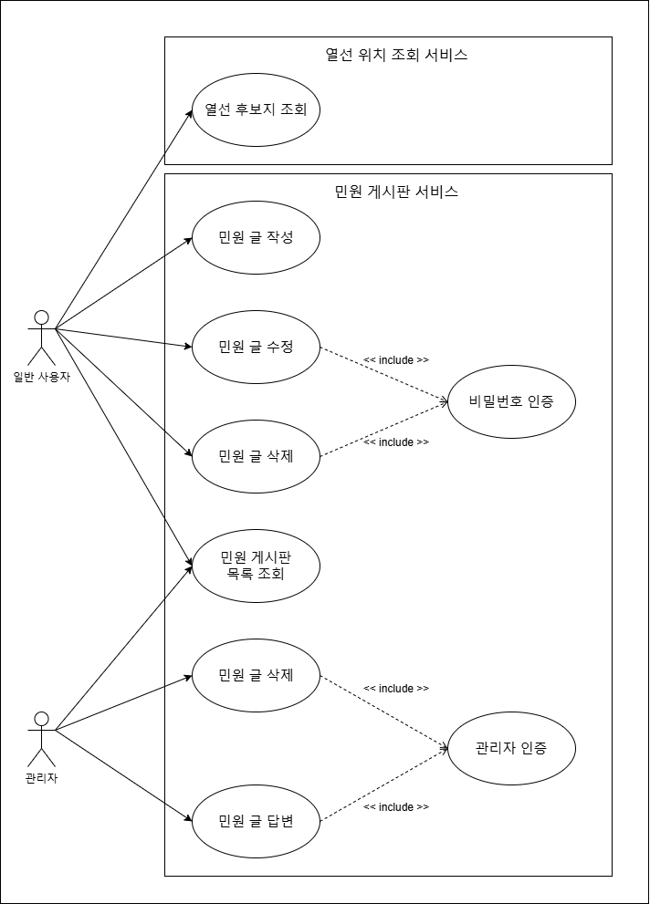
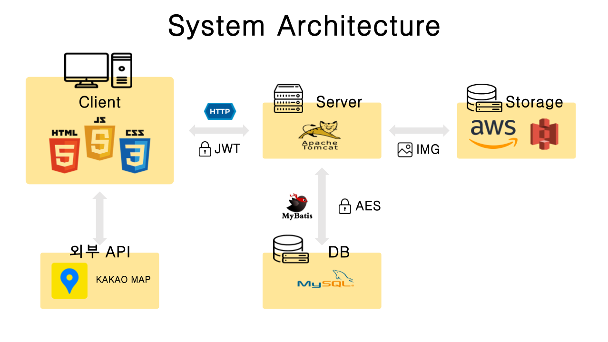

## 📅 프로젝트 기간
2025.03.24 ~ 2025.04.21 (4주)

## ⭐ 주요 기능
* 민원 작성
* 민원 수정 및 삭제
* 관리자 로그인
* 관리자의 민원 답변
* 데이터 기반으로 분석한 새로운 열선 후보지 조회

---
## ⛏ 기술스택
<table>
    <tr>
        <th>구분</th>
        <th>내용</th>
    </tr>
    <tr>
        <td>사용언어</td>
        <td>
             
            
            
            
             
        </td>
    </tr>
    <tr>
        <td>프레임워크 & 라이브러리</td>
        <td>
            
            
            
            
             
            
            
        </td>
    </tr>
    <tr>
        <td>데이터베이스</td>
        <td>
            
        </td>
    </tr>
    <tr>
        <td>서버환경</td>
        <td>
          
        </td>
    </tr>
    <tr>
        <td>개발환경</td>
        <td>
           
        </td>
    </tr>
    <tr>
        <td>클라우드</td>
        <td>
            
        </td>
    </tr>
    <tr>
        <td>보안</td>
        <td>
            
            
        </td>
    </tr>
    <tr>
        <td>협업도구</td>
        <td>
             
            
            
        </td>
    </tr>
</table>

---
## 참가한 공모전
🔗 **[2025년 광진구 빅데이터 분석 공모전](https://www.gwangjin.go.kr/portal/bbs/B0000003/view.do?nttId=6351995&menuNo=200192&pSiteId=portal&pageIndex=2)**

---

## 🎯프로젝트 목적

### 서울시 광진구 도로 열선 설치를 위한 우선순위 파악 및 웹 개발 능력 향상
- ✔️ **도로의 결빙** 문제는 위험성이 높음.
- ✔️ 도로 결빙 해결을 위한 기존 **제설제**는 차량과 아스팔트를 녹이는 부작용이 있음.
- ✔️ 이를 해결하기 위해 **도로 열선**의 필요성이 증가하고 있음.

---

## 🏁 기대 효과
- 🚀 광진구의 도로 결빙 문제 해결을 위한 **실질적인 데이터 기반 정책 수립** 지원
- 🚀 같은 문제를 고민중인 다른 지자체의 경우도 **실질적인 데이터 기반 정책 수립** 지원
- 🚀 머신러닝 및 빅데이터 분석 경험을 통해 **실무 능력 향상**
- 🚀 협업을 통한 **팀워크 및 커뮤니케이션 능력 강화**
  
## 역할 분배
- 👑 **문정진(팀장)** : 서비스 페이지 제작, 프로젝트 총괄
- 👨‍💻 **황준하** : 머선러닝, 데이터 분석
- 👨‍💻 **손종희** : 서비스 페이지 제작, 데이터 정제
- 👩‍💻 **이윤미** : 데이터 분석
  
---

## Entity Relationship Diagram

## Use Case Diagram

## System Architecture

---

## 📌 데이터 출처

### 🏢 **[서울 열린데이터 광장](https://data.seoul.go.kr/)**
- [서울시 어린이집 정보 (표준 데이터)](https://data.seoul.go.kr/dataList/OA-20300/S/1/datasetView.do)
- [서울시 학교 기본정보](https://data.seoul.go.kr/dataList/OA-20502/S/1/datasetView.do)
- [서울시 사회복지시설 목록](https://data.seoul.go.kr/dataList/OA-20376/S/1/datasetView.do)
- [서울시 지역아동센터 시설현황정보](https://data.seoul.go.kr/dataList/OA-20967/S/1/datasetView.do)
- [서울시 도로노선 정보]( https://data.seoul.go.kr/dataList/OA-15496/S/1/datasetView.do)

### 🏢 **[Google Maps Platform](https://developers.google.com/maps?hl=ko)**
- [도로 고도 데이터](https://developers.google.com/maps/documentation/elevation/start?hl=ko)

### 🛰 [Google Earth Engine - LANDSAT 8](https://developers.google.com/earth-engine/datasets/catalog/LANDSAT_LC08_C02_T1_L2?hl=ko)
- 표면온도 추출용 이미지 컬렉션  
  `landsat = ee.ImageCollection('LANDSAT/LC08/C02/T1_L2')`
  
---
